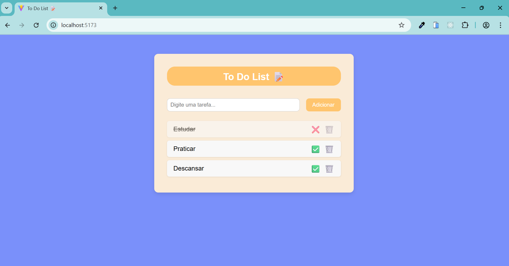

# 📝 To Do List com React

Este é um projeto simples de lista de tarefas (To Do List) desenvolvido com **React**. O objetivo é praticar conceitos fundamentais como **estados (useState)**, manipulação de **eventos**, e **estilização com CSS puro**.

 <!-- Substitua pelo caminho correto -->

## 🚀 Funcionalidades

- Adicionar tarefas
- Marcar tarefas como concluídas
- Remover tarefas
- Interface responsiva e estilizada

## 🛠️ Tecnologias utilizadas

- [React](https://react.dev/)
- HTML
- CSS
